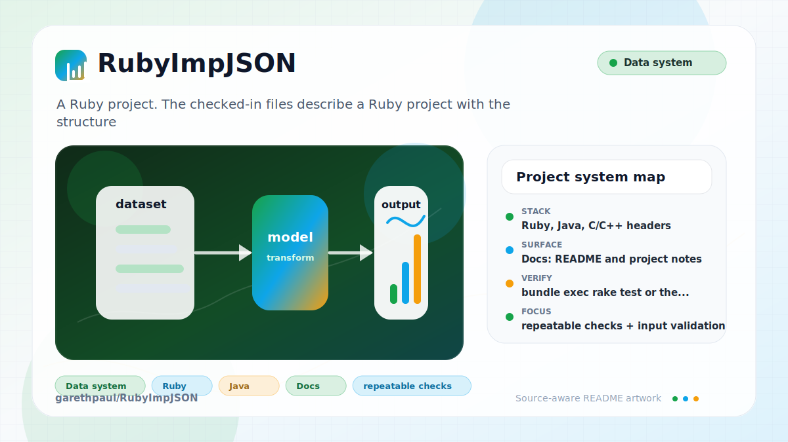

# RubyImpJSON

<!-- README-OVERVIEW-IMAGE -->


## Overview

`garethpaul/RubyImpJSON` is a Ruby project. The checked-in files describe a Ruby project with the structure summarized below.

This README is based on the checked-in source, manifests, scripts, and repository metadata on the `master` branch. The project language mix found during review was: Ruby (35), Java (12), C/C++ headers (3), C (2), JavaScript (1).

## Repository Contents

- `README.md` - project overview and local usage notes
- `ARCHIVE_STATUS.md` - historical snapshot and verification baseline
- `CHANGES.md` - maintenance history for archive verification
- `Makefile` - local verification entry points
- `data` - source or example code
- `docs/plans` - completed maintenance plans for the current baseline
- `ext` - source or example code
- `Gemfile`
- `java` - source or example code
- `lib` - source or example code
- `plans` - historical implementation notes
- `scripts` - archive metadata validators
- `SECURITY.md` - security reporting and disclosure guidance
- `tests` - source or example code
- `tools` - source or example code
- `VISION.md` - project direction and maintenance guardrails

Additional scan context:

- Source directories: data, ext, java, lib, tests, tools
- Dependency and build manifests: Gemfile
- Entry points or build surfaces: none detected
- Test-looking files: tests/fixtures/fail1.json, tests/fixtures/fail10.json, tests/fixtures/fail11.json, tests/fixtures/fail12.json, tests/fixtures/fail13.json, tests/fixtures/fail14.json, tests/fixtures/fail18.json, tests/fixtures/fail19.json, and 4 more

## Getting Started

### Prerequisites

- Git
- Ruby and Bundler

### Setup

```bash
git clone https://github.com/garethpaul/RubyImpJSON.git
cd RubyImpJSON
bundle install
```

The setup commands above are derived from repository files. Legacy mobile, Python, or JavaScript samples may require older SDKs or package versions than a modern workstation uses by default.

## Running or Using the Project

- Read `ARCHIVE_STATUS.md` before treating this repository as an active fork or
  supported gem release.
- Archived version: 1.7.5, matching the checked-in `VERSION` file and gemspecs.
- No single runtime entry point was identified. Start by reading the source files and manifests listed above.

## Testing and Verification

- `bundle exec rake test` or the repository-specific Ruby test command
- `make check` delegates to `make verify`, which runs archive metadata checks
  and the pure-Ruby test corpus with `JSON=pure`, avoiding Bundler and native
  extension compilation for the default local verification path.
- The archive metadata check also requires completed canonical plans under
  `docs/plans`.
- The fixture corpus includes malformed-input cases such as an unterminated
  block comment, preserving parser rejection behavior for archived tests.
- The pure parser tests also cover accepted comment behavior, including `//`
  line comments terminated by end-of-file.
- The checked-in `json` and `json_pure` gemspec manifests are checked against
  the fixture corpus so packaged archives retain every parser fixture.
- The archive metadata check keeps the README archived version aligned with the
  checked-in `VERSION` file.

When the required SDK or runtime is unavailable, use static checks and source review first, then verify on a machine that has the matching platform toolchain.

## Configuration and Secrets

- No required secret or credential file was identified in the repository scan. If you add integrations later, keep secrets out of git.

## Security and Privacy Notes

- Review changes touching authentication or token handling; examples from the scan include ext/json/ext/parser/parser.c, java/src/json/ext/Generator.java, java/src/json/ext/Parser.java, lib/json/pure/parser.rb.
- Review changes touching network requests, sockets, or service endpoints; examples from the scan include .travis.yml, data/index.html, data/prototype.js, lib/json.rb, and 2 more.
- Review changes touching file, media, JSON, XML, CSV, OCR, or data parsing; examples from the scan include Gemfile, data/index.html, data/prototype.js, ext/json/ext/generator/extconf.rb, and 6 more.
- Review changes touching shell execution, subprocess, or dynamic evaluation; examples from the scan include data/prototype.js, tests/test_json.rb.

## Maintenance Notes

- See `ARCHIVE_STATUS.md` for the historical snapshot boundary and verification baseline.
- See `SECURITY.md` for vulnerability reporting and safe research guidance.
- See `VISION.md` for project direction and contribution guardrails.
- See `docs/plans/2026-06-08-rubyimpjson-baseline.md` for the canonical
  archive verification baseline.
- See `docs/plans/2026-06-08-malformed-comment-fixture.md` for the malformed
  comment fixture update.
- See `docs/plans/2026-06-09-gemspec-fixture-manifest.md` for the fixture
  packaging manifest guard.
- See `docs/plans/2026-06-09-eof-line-comment.md` for the pure parser EOF
  line-comment compatibility guard.
- See `docs/plans/2026-06-09-readme-version-guard.md` for the README archived
  version guard.

## Contributing

Keep changes small and tied to the project that is already present in this repository. For code changes, document the toolchain used, avoid committing generated dependency directories or local configuration, and update this README when setup or verification steps change.
